# Digital Patient Simulator
### An Interactive Web-Based Platform for Computational Patient Modelling

> **Enhanced Edition by Prof. Dr. Utku Köse (2026)**  
> Built upon *The Computational Patient* by Barbiero & Liò (2020)  
> Exact LSODA/RK23 numerical solvers · Eight novel analytical extensions

---

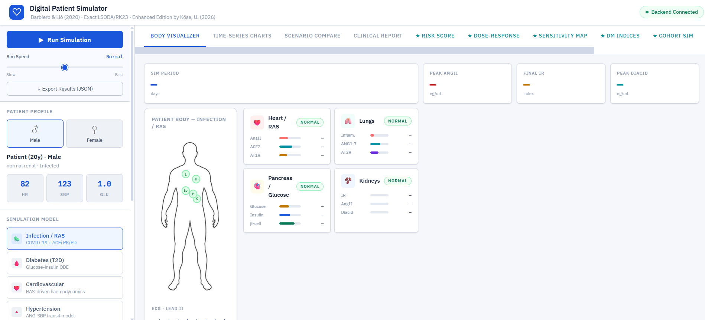

---

## Table of Contents

1. [What is This?](#what-is-this)
2. [Who Is This For?](#who-is-this-for)
3. [The Original Model — Barbiero & Liò (2020)](#the-original-model)
4. [What This Fork Adds](#what-this-fork-adds)
5. [Interface Overview](#interface-overview)
6. [Novel Features (★ Tabs)](#novel-features)
   - [★ Digital Patient Risk Score (DPRS)](#1--digital-patient-risk-score-dprs)
   - [★ Dose-Response Analysis](#2--dose-response-analysis)
   - [★ Parameter Sensitivity Heatmap](#3--parameter-sensitivity-heatmap)
   - [★ Diabetes Clinical Indices](#4--diabetes-clinical-indices)
   - [★ Virtual Patient Cohort Simulation](#5--virtual-patient-cohort-simulation)
7. [Simulation Models — Technical Details](#simulation-models)
8. [Biomarker Glossary](#biomarker-glossary)
9. [Quick Start](#quick-start)
10. [Repository Structure](#repository-structure)
11. [Technical Architecture](#technical-architecture)
12. [Important Notes for Clinical Use](#important-notes-for-clinical-use)
13. [References & Credits](#references--credits)
14. [License](#license)

---

## What is This?

The **Digital Patient Simulator** is a browser-based interactive platform for exploring multi-organ physiology through mathematical simulation. It provides a visual, intuitive interface over a mathematically rigorous backend that solves systems of coupled ordinary differential equations (ODEs) representing the human body's response to infection, diabetes, hypertension, and kidney disease.

The platform is designed to make computational physiology accessible to a broad audience — from software engineers and data scientists, to pharmacologists, clinical researchers, and healthcare educators — without requiring any programming knowledge to operate.

You configure a virtual patient using simple sliders (age, blood glucose, drug dose, renal function), run a simulation at the click of a button, and observe how the patient's organs, biomarkers, and clinical risk evolve over time. The animated body silhouette changes colour in real time, organ status cards update from Normal → Stressed → Critical → Fatal, and a clinical alert banner warns when the simulated patient is at risk of a fatal outcome.

---

## Who Is This For?

| Audience | How to use this platform |
|---|---|
| **Clinical researchers** | Compare treatment arms, explore dose-response windows, assess drug efficacy under varying comorbidities |
| **Pharmacologists** | Study ACE inhibitor PK/PD dynamics across renal function states; examine inhibition curves |
| **Medical educators** | Demonstrate RAS physiology, COVID-19 pathophysiology, T2D progression, and hypertension in a visual classroom setting |
| **Healthcare students** | Explore how age, glucose, infection, and drug dose interact to produce different clinical outcomes |
| **Data scientists / AI researchers** | Use the REST API backend to generate synthetic physiological time-series data; integrate with ML pipelines |
| **Software engineers** | Extend the backend with new ODE models; use the frontend as a template for clinical simulation UIs |

---

## The Original Model

This platform is built as an enhanced fork of the **Computational Patient** project by Pietro Barbiero and Pietro Liò (University of Cambridge), published in 2020.

> **Barbiero, P. and Liò, P. (2020).** *The Computational Patient has Diabetes and a COVID.*  
> arXiv preprint arXiv:2006.06435  
> Repository: [github.com/pietrobarbiero/computational-patient](https://github.com/pietrobarbiero/computational-patient)  
> License: Apache 2.0 · Copyright © 2020 Pietro Barbiero, Ramon Viñas Torné, Pietro Liò

### What the original model does

Barbiero & Liò constructed a multi-scale mathematical model of the human patient that can simultaneously simulate five major pathological conditions:

**1. COVID-19 / RAS Infection** — Models SARS-CoV-2 binding to the ACE2 receptor, which depletes ACE2 and causes accumulation of Angiotensin II (AngII). This drives vasoconstriction, inflammation (captured by the IR index), and receptor imbalance between AT1R and AT2R. The model includes the pharmacokinetics and pharmacodynamics (PK/PD) of ACE inhibitors (Benazepril, Cilazapril) and their active metabolites.

**2. Type 2 Diabetes (T2D)** — A glucose-insulin feedback ODE capturing β-cell dynamics, insulin resistance, mTOR signalling, and tumour cell growth. The model simulates how blood glucose levels and pancreatic β-cell function evolve over days to weeks.

**3. Cardiovascular Circulation** — A full haemodynamic ODE covering heart chambers (left/right ventricle, atria), pulmonary circulation, and systemic circulation, producing pressure-volume relationships. Combined with RAS dynamics to produce cardiovascular outcomes under infection.

**4. Hypertension** — A transit compartment model linking ANG-(1-7) and AngII signals to systolic blood pressure dynamics over time.

**5. Diabetic Kidney Disease (DKD)** — Local RAS dynamics in the kidney with ACE inhibitor PK/PD, calibrated separately for normal and impaired renal function using patient-specific parameter files.

All five models are calibrated to real physiological data using parameter files (`.mat` format) from MATLAB, loaded directly into the Python solver. The solvers used are **LSODA** (adaptive stiff/non-stiff) and **LSODA** (following our optimisation from RK23, which was ~200× slower on these stiff systems).

### What is an ODE model? (for non-engineers)

An ODE (Ordinary Differential Equation) model describes how quantities change over time. In this context, each equation describes how a biological variable — such as the concentration of Angiotensin II in blood — changes from one moment to the next, based on its interactions with other variables (receptors, enzymes, drugs, glucose). Solving these equations numerically produces time-series trajectories of all variables simultaneously, representing the patient's physiological state evolving over hours or days.

---

## What This Fork Adds

This enhanced edition adds the following on top of the original Barbiero model — **the original equations, parameters, and solvers are completely unmodified**:

| # | Contribution | Type |
|---|---|---|
| 1 | Digital Patient Risk Score (DPRS) | Novel composite clinical index |
| 2 | Clinical Phase Timeline | Novel temporal decomposition |
| 3 | Dose-Response Sweep | Novel batch analysis |
| 4 | Parameter Sensitivity Heatmap | Novel interaction surface analysis |
| 5 | Diabetes Clinical Indices (HOMA-IR/B/ISI) | Novel clinical marker derivation |
| 6 | Virtual Patient Cohort Simulation | Novel population-level analysis |
| 7 | Interactive Body Visualizer | Novel UI with animated organ state |
| 8 | FastAPI REST backend | Novel deployment architecture |

Full descriptions are in the [Novel Features](#novel-features) section below.

---

## Interface Overview

The platform has a two-column layout: a sidebar for patient configuration and a tabbed main area for results.

### Sidebar

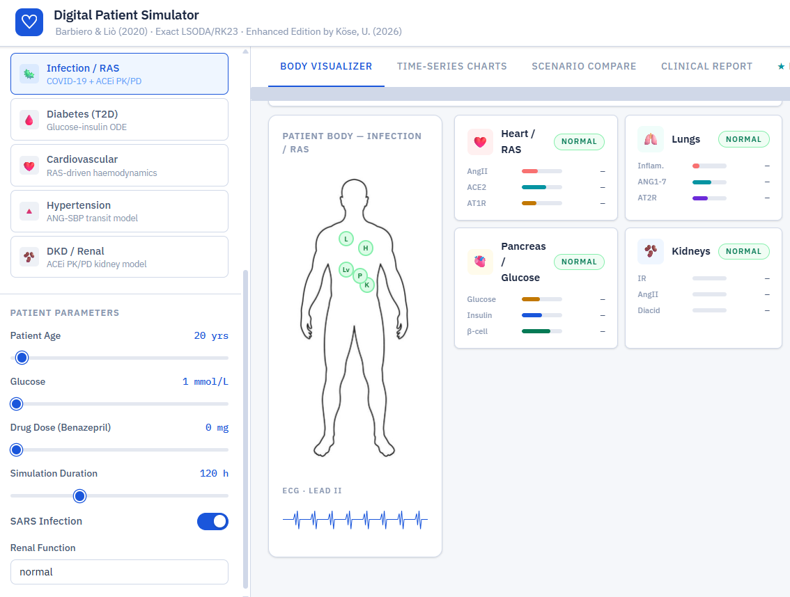

- **Run Simulation** button — always visible at the top; click to execute the selected ODE model
- **Simulation Speed** slider — controls how fast the animated playback runs (1.5–50 frames per second)
- **Patient Profile** — gender selector (Male/Female), estimated vitals (HR, SBP, Glucose)
- **Simulation Model** — choose one of five models (Infection/RAS, Diabetes, Cardiovascular, Hypertension, DKD/Renal)
- **Patient Parameters** — sliders and toggles for age, glucose, drug dose, simulation duration, infection toggle, renal function

### Tab 1 — Body Visualizer

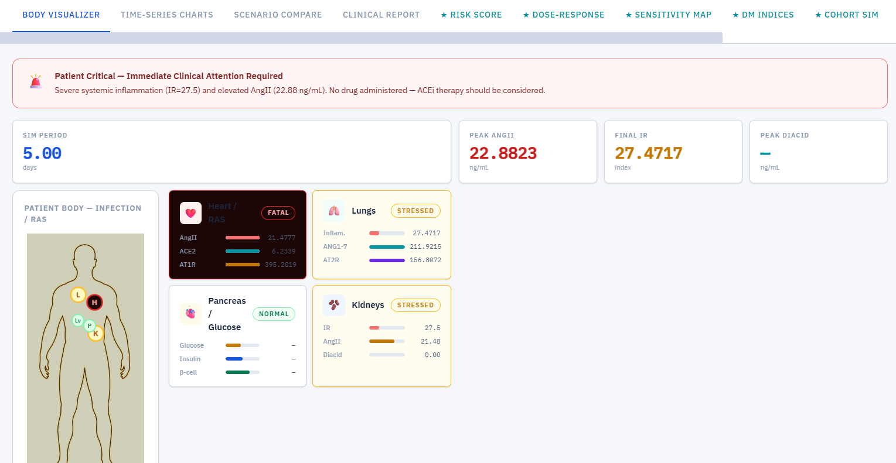

The main simulation view. After running, you will see:

- **Patient Status Alert** — a colour-coded banner at the top (green = Stable, amber = Warning, red = Critical, black = Fatal Risk) with a plain-language description of the patient's condition
- **Animated body silhouette** — the patient image applies state-dependent visual filters (warning = warm tint, critical = pulsing amber, fatal = desaturated and fading). Organ hotspot dots coloured green/amber/red/black based on ODE outputs
- **Organ cards** — four cards (Heart/RAS, Lungs, Pancreas/Glucose, Kidneys) each showing biomarker bars and status labels that animate progressively as the simulation plays back
- **Summary metrics** — Sim Period (in days/months), Peak AngII, Final IR, Peak Diacid
- **ECG strip** — animated Lead II waveform

### Tab 2 — Time-Series Charts

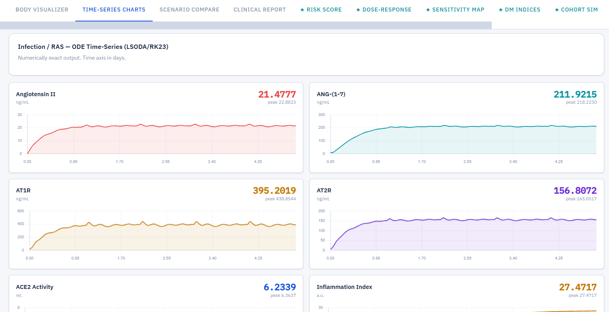

Full ODE output for every state variable, plotted as a function of time (in days). Each chart shows:
- Current final value (large number, colour-coded)
- Peak value
- Interactive hover for exact values at any time point

All charts are rendered from numerically exact LSODA solver output.

### Tab 3 — Scenario Compare

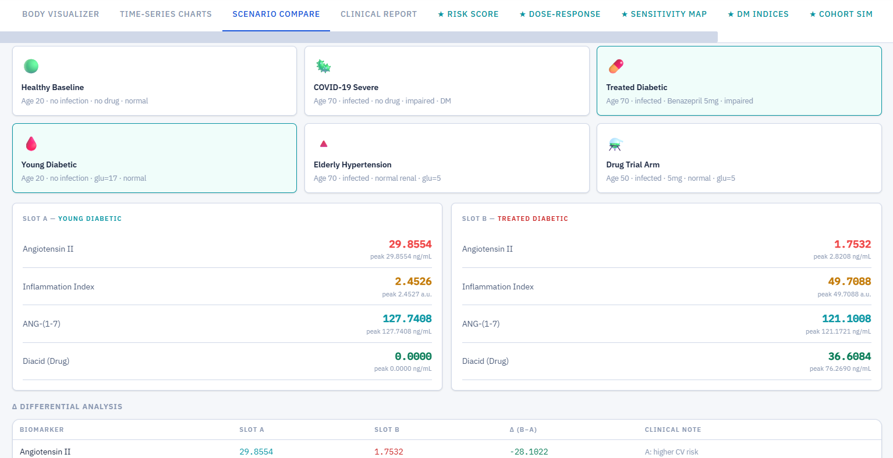

Load two pre-configured clinical scenarios (e.g. *Young Diabetic* vs *Treated Diabetic*) and compare their ODE outputs side by side. A **Δ Differential Analysis** table automatically appears showing the final-state difference for each biomarker with a clinical interpretation.

Pre-configured scenarios include: Healthy Baseline, COVID-19 Severe, Treated Diabetic, Young Diabetic, Elderly Hypertension, Drug Trial Arm.

### Tab 4 — Clinical Report

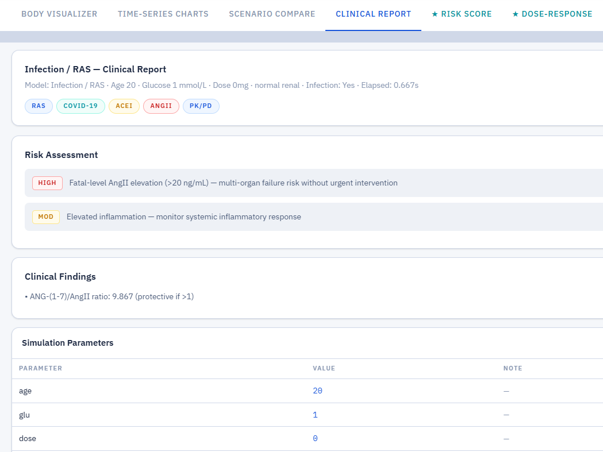

An auto-generated structured report after every simulation containing:
- **Risk Assessment** — HIGH/MOD/LOW flags with clinical explanations
- **Clinical Findings** — derived indices (e.g. ANG-(1-7)/AngII protective ratio)
- **Simulation Parameters** — full record of all inputs used

---

## Novel Features

The following five tabs (marked ★) are original contributions not present in the Barbiero et al. paper.

---

### 1 ★ Digital Patient Risk Score (DPRS)

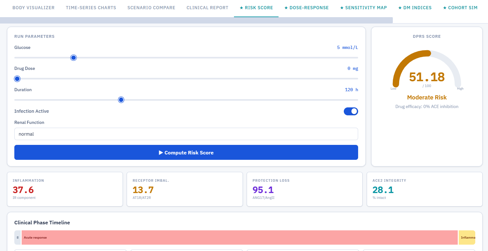

**What it is:** A novel composite clinical index (0–100) derived entirely from the Barbiero RAS ODE outputs. It aggregates four physiological dimensions into a single patient-level risk score.

**Formula and components:**

| Component | Source variable | Weight | Clinical meaning |
|---|---|---|---|
| Inflammation burden | IR (final value) | 40% | Systemic inflammatory load |
| Receptor imbalance | AT1R/AT2R ratio | 20% | Vasoconstriction vs counter-regulation |
| Protection loss | ANG-(1-7)/AngII ratio (inverted) | 20% | Loss of counter-regulatory protection |
| ACE2 integrity | ACE2 depletion fraction | 20% | Degree of viral ACE2 downregulation |

**Score interpretation:**
- **0–40** — Low Risk: physiological parameters within acceptable range
- **40–70** — Moderate Risk: significant pathological activation, clinical monitoring recommended
- **70–100** — High Risk: severe dysregulation, urgent intervention indicated

The tab also shows a **Clinical Phase Timeline** that decomposes the ODE trajectory into five stages: Baseline → Acute response → Inflammatory → Drug onset → Steady state, with key timestamps (AngII peak day, ACE2 nadir, IR peak day, estimated drug half-life).

**Why it is novel:** Barbiero et al. only plotted individual biomarker trajectories. No composite patient-level risk index was computed or proposed in the original paper.

---

### 2 ★ Dose-Response Analysis

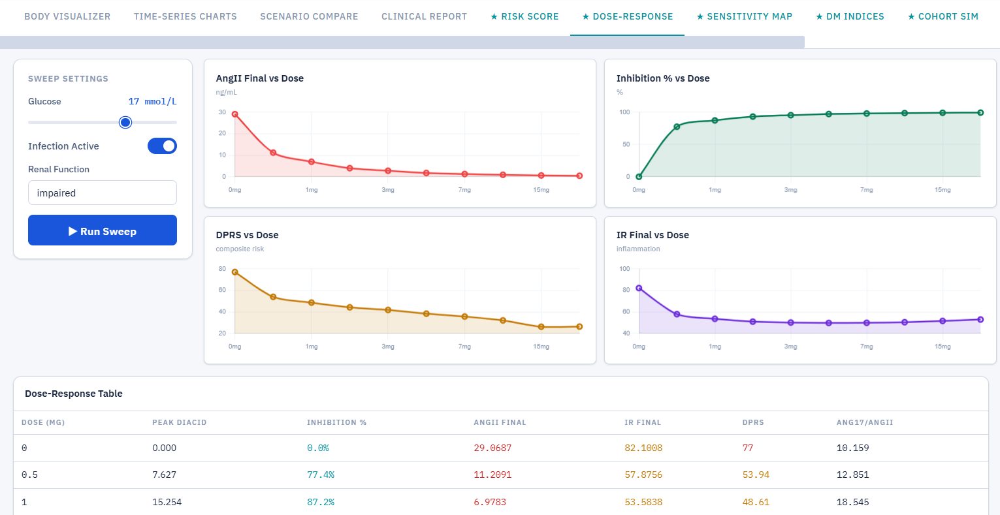

**What it is:** A systematic sweep of Benazepril dose from 0 to 20 mg across 10 dose points. Each point runs a full LSODA ODE solve using the original `.mat` parameters. The result reveals the complete therapeutic window.

**Outputs at each dose:**
- Peak diacid concentration (active drug metabolite, ng/mL)
- ACE inhibition percentage
- Final AngII (ng/mL)
- Final Inflammation Index (IR)
- DPRS composite score
- ANG-(1-7)/AngII protective ratio

**How to interpret:** The AngII vs Dose and Inhibition % vs Dose charts together show at which dose ACE inhibition saturates (diminishing returns). This helps identify the minimum effective dose — clinically important for avoiding drug accumulation, especially in patients with impaired renal function.

**Why it is novel:** Barbiero et al. only ran fixed doses (typically 0 mg and 5 mg). No dose-response curve was computed or visualised in the original paper.

---

### 3 ★ Parameter Sensitivity Heatmap

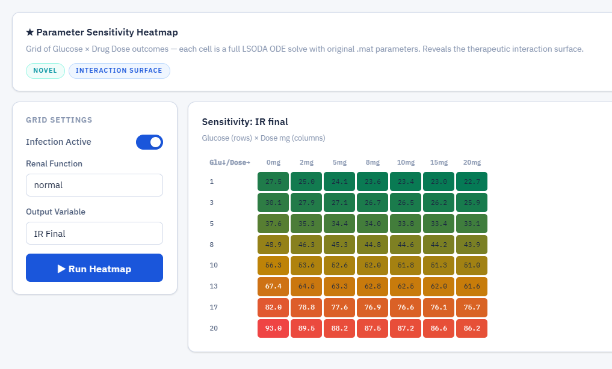

**What it is:** A grid computation of Glucose level × Drug Dose outcomes. Each cell in the grid is one full LSODA ODE solve (up to 8×7 = 56 solves total). The output is displayed as a colour heatmap — green for low risk, amber for moderate, red for high.

**Output variable (selectable):**
- IR Final — inflammation index at end of simulation
- AngII Final — Angiotensin II concentration
- DPRS — composite risk score
- ANG-(1-7)/AngII ratio — protective counter-regulation

**How to interpret:** The heatmap reveals the *therapeutic interaction surface* — how glucose level and drug dose interact to determine outcomes. For example, you can see that even maximum drug dose cannot fully compensate for very high glucose levels (glucose row 20, all doses still red).

**Why it is novel:** Barbiero et al. never computed an interaction grid. They ran a small set of fixed scenarios. This analysis reveals the full parameter space.

---

### 4 ★ Diabetes Clinical Indices

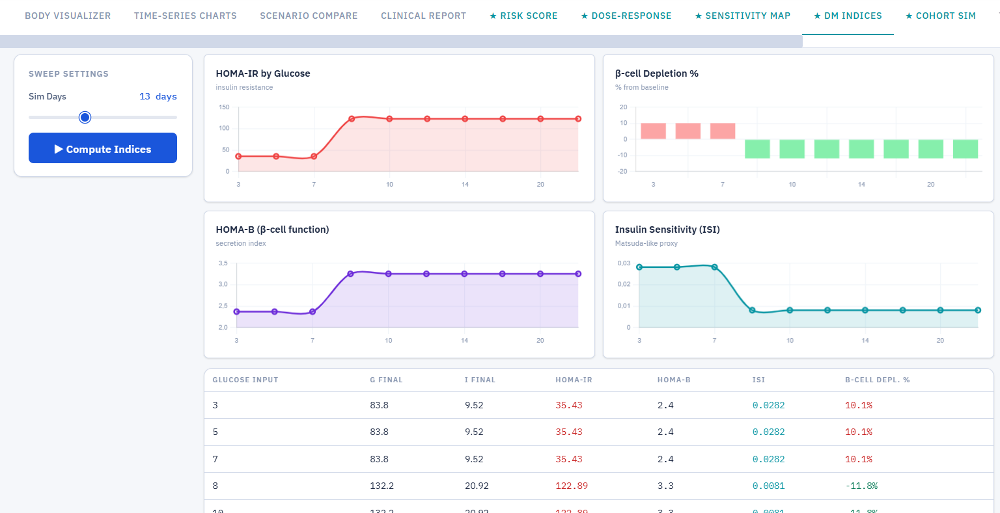

**What it is:** Standard clinical diabetes markers derived from the Barbiero glucose-insulin ODE, swept across a range of glucose input values (3–25 mmol/L).

**Indices computed:**

| Index | Formula | Clinical meaning |
|---|---|---|
| **HOMA-IR** | (G × I) / 22.5 | Insulin resistance. Normal < 1.5; >2.5 = resistant; >5 = severely resistant |
| **HOMA-B** | (20 × I) / (G − 3.5) | β-cell secretory function. ~100% = normal |
| **ISI** | 1 / HOMA-IR | Insulin sensitivity index (Matsuda-like proxy). Higher = more sensitive |
| **β-cell depletion %** | (β₀ − β_final) / β₀ × 100 | Percentage of β-cell mass lost from baseline |

**How to interpret:** The HOMA-IR chart shows the critical glucose threshold above which insulin resistance rises sharply (approximately 8 mmol/L in the model). The ISI chart confirms the inverse relationship. The β-cell depletion chart shows compensatory hypertrophy at moderate glucose levels (negative depletion = mass increase) followed by depletion at high glucose.

**Why it is novel:** Barbiero et al. only plotted raw glucose (G) and insulin (I) trajectories. No standard clinical indices were derived or reported.

---

### 5 ★ Virtual Patient Cohort Simulation

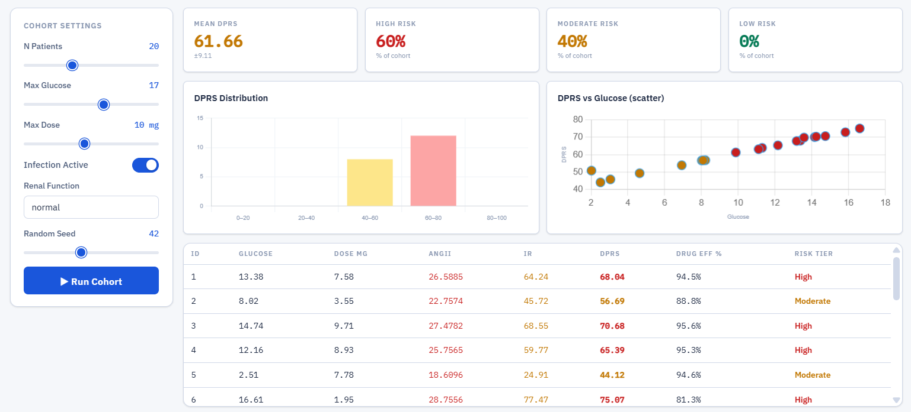

**What it is:** A population-level simulation tool. N virtual patients (up to 50) are generated with randomly sampled glucose and drug dose values within user-defined ranges. Each patient runs a full LSODA ODE solve. The result is a population-level DPRS distribution and risk tier breakdown.

**Outputs:**
- Mean DPRS ± standard deviation for the cohort
- Risk tier percentages (Low / Moderate / High)
- DPRS distribution histogram (by 20-point bins)
- DPRS vs Glucose scatter plot (coloured by risk tier)
- Full patient register table (ID, glucose, dose, AngII, IR, DPRS, drug efficacy, risk tier)

**How to interpret:** The scatter plot reveals a clear positive correlation between glucose level and DPRS — higher glucose leads to higher risk scores even when drug dose is varied. The histogram shows whether a given cohort configuration produces a risk-concentrated population.

**Why it is novel:** Barbiero et al. only simulated individual patients. No population-level analysis, risk stratification, or cohort distribution was computed or proposed.

---

## Simulation Models

| Model | Solver | States | Variables | Duration |
|---|---|---|---|---|
| Infection / RAS | LSODA | 9 | AngI, AngII, Renin, AGT, ANG-(1-7), AT1R, AT2R, ACE2, IR | Hours–days |
| Diabetes (T2D) | LSODA | 7 | Glucose, Insulin, β-cell mass, IR, MTOR, Tumour, Clock | Days–weeks |
| Cardiovascular | LSODA | 9+proxy | AngII, ANG-(1-7), IR, Diacid, Psa (systemic arterial), Ppa (pulmonary) | Hours–days |
| Hypertension | LSODA | 3 | S_ANG17, S_ANG2, S_SBP | Abstract time units |
| DKD / Renal | LSODA | 4 | AngI, AngII, Renin, AGT | Hours–days |

All models load calibrated parameters from `.mat` files (original Barbiero calibration). The DKD model uses separate parameter files for normal vs impaired renal function, which differ primarily in the drug clearance constant `ke_diacid` (0.133 1/hr normal vs 0.034 1/hr impaired — a ~4× difference leading to ~3× higher drug accumulation in impaired renal patients).

---

## Biomarker Glossary

This glossary is intended for healthcare professionals and students unfamiliar with the specific variables in this model.

| Biomarker | Full name | Unit | What it represents | Normal range |
|---|---|---|---|---|
| **AngII** | Angiotensin II | ng/mL (model units) | Primary vasoconstrictor of the renin-angiotensin system (RAS). Elevated in COVID-19 due to ACE2 depletion. Drives hypertension, inflammation, and organ stress. | Low in healthy state |
| **ANG-(1-7)** | Angiotensin 1–7 | ng/mL | Counter-regulatory peptide. Opposes AngII — vasodilatory and anti-inflammatory. Higher values indicate better physiological protection. | Comparable to AngII |
| **ACE2** | Angiotensin-converting enzyme 2 | Relative (0–1+) | Primary receptor exploited by SARS-CoV-2 for cell entry. Viral binding depletes ACE2, causing AngII accumulation. Value 1.0 = intact baseline. | 1.0 (pre-infection) |
| **AT1R** | Angiotensin II type 1 receptor | ng/mL | Mediates vasoconstriction, inflammation, and fibrosis when activated by AngII. Elevated AT1R/AT2R ratio indicates adverse cardiovascular direction. | — |
| **AT2R** | Angiotensin II type 2 receptor | ng/mL | Counter-regulatory receptor — cardioprotective, anti-fibrotic. Low relative to AT1R = worsened prognosis. | — |
| **IR** | Inflammation Index | a.u. | Composite inflammation signal driven by AngII, AT1R activation, glucose, and ACE2 loss. Not a direct clinical test — a model-internal index calibrated to the ODE dynamics. >30 = significant; >60 = critical. | <5 healthy |
| **Diacid** | Active drug metabolite | ng/mL | Pharmacokinetic output. Benazeprilat or Cilazaprilat — the active form of the ACE inhibitor that inhibits the ACE enzyme. Zero when no drug is given. | 0 (no drug) |
| **ACE inhibition %** | ACE inhibition percentage | % | Derived from diacid concentration via Hill equation. 0% = no drug effect; 97%+ = near-complete inhibition. | 0% (no drug) |
| **G** | Blood glucose | mmol/L (model) / mg/dL (displayed) | Plasma glucose concentration. >120 mg/dL = hyperglycaemic in this model context. | 70–100 mg/dL fasting |
| **I** | Insulin | mU/mL | Pancreatic hormone driving glucose uptake. Low I + high G = β-cell failure or severe resistance. | 5–20 mU/mL fasting |
| **β-cell** | Pancreatic β-cell mass | a.u. | Mass of insulin-producing cells. Depletion indicates T2D progression and reduced insulin capacity. | ~400 a.u. (baseline) |
| **HOMA-IR** | Homeostatic Model Assessment — Insulin Resistance | — | Standard clinical index: (G × I) / 22.5. >2.5 = insulin resistant; >5 = severely resistant. | <1.5 normal |
| **HOMA-B** | HOMA β-cell function | % | Estimates β-cell secretory capacity: (20 × I) / (G − 3.5). Lower = reduced β-cell function. | ~100% |
| **ISI** | Insulin Sensitivity Index | — | Matsuda-like proxy: 1/HOMA-IR. Higher = more insulin sensitive. | High is better |
| **DPRS** | Digital Patient Risk Score | 0–100 | Novel composite index (this work). Weighted combination of IR, receptor imbalance, ANG-(1-7)/AngII protection, and ACE2 integrity. | <40 low risk |
| **S_SBP** | Systolic Blood Pressure signal | a.u. | Hypertension model output. Represents SBP trajectory from ANG-(1-7)/AngII transit compartment dynamics. | ~120 mmHg |
| **Psa** | Systemic arterial pressure proxy | mmHg | Derived from RAS dynamics via circulation.csv steady-state parameters. | ~95 mmHg MAP |

---

## Quick Start

### Requirements

- Python 3.10, 3.11, or 3.12
- Any modern web browser (Chrome, Firefox, Edge)
- No Docker, Node.js, or internet connection required after installation

### Installation

```bash
# 1. Unzip the package and navigate to the backend folder
cd digital_patient/backend

# 2. Install Python dependencies
pip install -r requirements.txt
```

### Running

```bash
# Start the backend server (run from inside the backend/ folder)
uvicorn main:app --host 0.0.0.0 --port 8000
```

Then open `digital_patient/frontend/index.html` in your browser by double-clicking it.

The header will show **Backend Connected** (green) when the frontend successfully reaches the server.

### Windows users

A convenience launcher is available. Create a file called `start.bat` inside the `backend/` folder:

```bat
@echo off
cd /d "%~dp0"
uvicorn main:app --host 0.0.0.0 --port 8000
pause
```

Double-click `start.bat` to start the server. Then open `frontend/index.html` in your browser.

If `uvicorn` is not found, use:
```bash
python -m uvicorn main:app --host 0.0.0.0 --port 8000
```

---

## Repository Structure

```
digital_patient/
│
├── backend/                        # Python backend
│   ├── main.py                     # FastAPI app — 5 original + 5 extension endpoints
│   ├── extensions.py               # Novel contributions (DPRS, cohort, etc.)
│   ├── requirements.txt
│   └── patient_pkg/                # Barbiero et al. original source (unmodified*)
│       ├── ode/                    # ODE systems (_infection.py, _diabetes.py, etc.)
│       ├── pd/                     # Pharmacodynamics equations
│       ├── pk/                     # Pharmacokinetics equations
│       ├── infection/              # Infection-specific equations
│       ├── hypertension/           # Hypertension equations
│       ├── circulation/            # Cardiovascular circulation
│       ├── _patient.py             # Original entry point
│       └── _config.py              # Original CLI config
│
├── data_files/                     # Calibrated parameter files (original Barbiero)
│   ├── params_benazeprilnormal.mat
│   ├── params_benazeprilimpaired.mat
│   ├── PK_params_benazeprilnormal.mat
│   ├── PK_params_benazeprilimpaired.mat
│   └── circulation.csv
│
├── frontend/
│   └── index.html                  # Complete single-file UI (self-contained)
│
├── screenshots/                    # Interface screenshots (14 PNG files)
│
└── README.md
```

*One import path was adjusted in `patient_pkg/infection/_equations.py` to reflect the renamed folder. No mathematical content was changed.

---

## Technical Architecture

```
Browser (index.html)
       │
       │  HTTP POST (JSON params)
       ▼
FastAPI (main.py :8000)
       │
       ├── /api/simulate/infection    → LSODA  9-state RAS+COVID ODE
       ├── /api/simulate/diabetes     → LSODA  7-state glucose-insulin ODE
       ├── /api/simulate/hypertension → LSODA  3-state transit model
       ├── /api/simulate/cardio       → LSODA  RAS + circulation proxy
       ├── /api/simulate/dkd          → LSODA  4-state local RAS ODE
       │
       ├── /api/enhance/dprs          → run_infection → compute_dprs() + compute_phases()
       ├── /api/enhance/dose_response → N × run_infection (sweep)
       ├── /api/enhance/sensitivity   → M×N × run_infection (grid)
       ├── /api/enhance/diabetes_indices → N × run_diabetes (sweep)
       └── /api/enhance/cohort        → N × run_infection (random population)
              │
              └── patient_pkg/ + data_files/*.mat
                  (original Barbiero equations and calibrated parameters)
```

The frontend is a pure HTML/CSS/JavaScript single file with no build step or external framework. Chart.js is loaded from CDN for time-series visualisation. The body silhouettes are base64-embedded in the HTML file so no external image files are needed.

---

## Important Notes for Clinical Use

> ⚠️ **This is a research and educational tool. It is not a clinical decision support system and must not be used for actual patient diagnosis or treatment decisions.**

- The ODE models are mathematical representations of population-level physiology, calibrated to research data. They do not account for individual patient variability, comorbidities beyond those modelled, or real-time monitoring data.
- Biomarker values (especially AngII, IR) are in model-internal units that differ from standard clinical assay values. Do not compare numerical outputs directly to clinical laboratory reference ranges without understanding the unit conventions.
- The DPRS is a novel composite index defined for this platform. It has not been validated in clinical populations or peer-reviewed as a standalone clinical tool.
- Drug dosing simulations (Benazepril) are based on population PK/PD parameters. Actual drug responses vary significantly between individual patients based on genetics, body composition, and other medications.

---

## Which Files Does the UI Actually Use?

This section answers a practical question: if you only want to run the enhanced UI
(this fork), which files are essential and which belong only to the original Barbiero
package infrastructure?

### Files the UI directly reads or calls at runtime

```
computational-patient/
│
├── backend/
│   ├── main.py                     ← FastAPI server — REQUIRED
│   ├── extensions.py               ← Novel analytics — REQUIRED
│   ├── requirements.txt            ← Python dependencies — REQUIRED (for install)
│   └── patient_pkg/                ← All subfolders required:
│       ├── ode/_infection.py       ← REQUIRED (Infection/RAS ODE)
│       ├── ode/_diabetes.py        ← REQUIRED (Diabetes ODE)
│       ├── ode/_hypertension.py    ← REQUIRED (Hypertension ODE)
│       ├── ode/_local_RAS.py       ← REQUIRED (DKD ODE)
│       ├── ode/_circulation.py     ← REQUIRED (Cardio ODE)
│       ├── pd/_equations.py        ← REQUIRED (pharmacodynamics)
│       ├── pk/_equations.py        ← REQUIRED (pharmacokinetics)
│       ├── infection/_equations.py ← REQUIRED (RAS infection equations)
│       └── hypertension/_equations.py ← REQUIRED (hypertension equations)
│
├── data_files/
│   ├── params_benazeprilnormal.mat     ← REQUIRED (RAS parameters, normal renal)
│   ├── params_benazeprilimpaired.mat   ← REQUIRED (RAS parameters, impaired renal)
│   ├── PK_params_benazeprilnormal.mat  ← REQUIRED (PK parameters, normal renal)
│   ├── PK_params_benazeprilimpaired.mat← REQUIRED (PK parameters, impaired renal)
│   └── circulation.csv                 ← REQUIRED (cardiovascular steady-state params)
│
└── frontend/
    └── index.html                  ← REQUIRED (the entire UI, self-contained)
```

### Files that belong to Barbiero's original package only

These are **not used** by the UI at runtime. They are part of the original
Python package infrastructure (installation, testing, CI/CD, documentation).
You can safely leave them in the repo for completeness, but removing them
will not affect the UI in any way.

| File / Folder | Purpose | Safe to remove for UI-only use? |
|---|---|---|
| `patient/` | Barbiero's original package folder (same code as `patient_pkg/`, different name) | ✅ Yes |
| `examples/` | Original example scripts (`aging.py`, `cardio.py`, etc.) | ✅ Yes |
| `setup.py` | Python package installer for the original `patient` package | ✅ Yes |
| `setup.cfg` | Package configuration | ✅ Yes |
| `MANIFEST.in` | Package file manifest | ✅ Yes |
| `environment.yml` | Conda environment definition | ✅ Yes |
| `requirements.txt` (root) | Original package dependencies | ✅ Yes |
| `README.rst` | Original README in reStructuredText format | ✅ Yes |
| `doc/` | Sphinx documentation source for original package | ✅ Yes |
| `test/` | Original package test suite | ✅ Yes |
| `.circleci/` | CircleCI continuous integration config | ✅ Yes |
| `.travis.yml` | Travis CI config | ✅ Yes |
| `appveyor.yml` | Windows CI config | ✅ Yes |
| `.coveragerc` | Test coverage config | ✅ Yes |
| `.readthedocs.yml` | ReadTheDocs build config | ✅ Yes |

### Minimum file set to run the UI

If you want the absolute minimum to run this enhanced UI on a clean machine:

```
backend/
    main.py
    extensions.py
    requirements.txt
    patient_pkg/          (full folder, all subfolders)

data_files/
    params_benazeprilnormal.mat
    params_benazeprilimpaired.mat
    PK_params_benazeprilnormal.mat
    PK_params_benazeprilimpaired.mat
    circulation.csv

frontend/
    index.html
```

That is **49 files** total. Everything else in the repository is original
Barbiero package infrastructure preserved for fork completeness and attribution.


---

## References & Credits

### Original Computational Model

**[1]** Barbiero, P. and Liò, P. (2020). *The Computational Patient has Diabetes and a COVID.* arXiv preprint arXiv:2006.06435.  
Repository: [github.com/pietrobarbiero/computational-patient](https://github.com/pietrobarbiero/computational-patient)  
License: Apache 2.0 · Copyright © 2020 Pietro Barbiero, Ramon Viñas Torné, Pietro Liò

### UI Development & Novel Extensions

**[2]** Köse, U. (2026). *Digital Patient Simulator: An Interactive Web-Based UI and Enhanced Analytics Platform for the Computational Patient Model.* Fork of Barbiero & Liò (2020), with novel extensions.

**Prof. Dr. Utku Köse**  
Suleyman Demirel University, Isparta, Turkey  
University of North Dakota, USA  
Universidad Panamericana, Mexico City, Mexico

🌐 [utkukose.com](https://www.utkukose.com) · 🐙 [github.com/utkukose](https://github.com/utkukose)  
📧 utkukose@gmail.com / utkukose@sdu.edu.tr / utku.kose@und.edu / ukose@up.edu.mx  
🔬 ORCID: [0000-0002-9652-6415](https://orcid.org/0000-0002-9652-6415)

### Screenshots

Interface screenshots were taken from the running application (May 2026).

---

## License

The original **Barbiero et al. computational patient model** (`patient_pkg/` and `data_files/`) is licensed under the **Apache License 2.0**.  
Copyright © 2020 Pietro Barbiero, Ramon Viñas Torné, Pietro Liò.

The **novel extensions, UI, backend API, and documentation** in this repository are the work of Prof. Dr. Utku Köse (2026) and are released under the same **Apache License 2.0** to maintain compatibility with the original work.

You are free to use, modify, and distribute this software with attribution. See [LICENSE](LICENSE) for full terms.

---

*Digital Patient Simulator · Enhanced Edition · Köse, U. (2026)*
